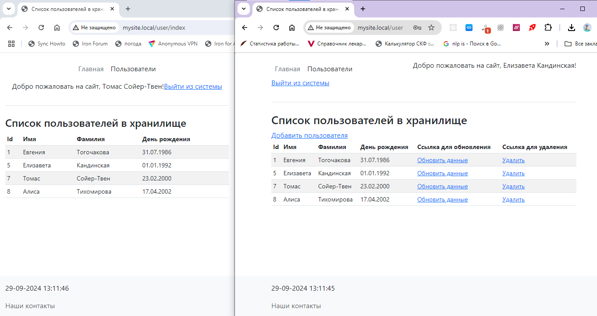
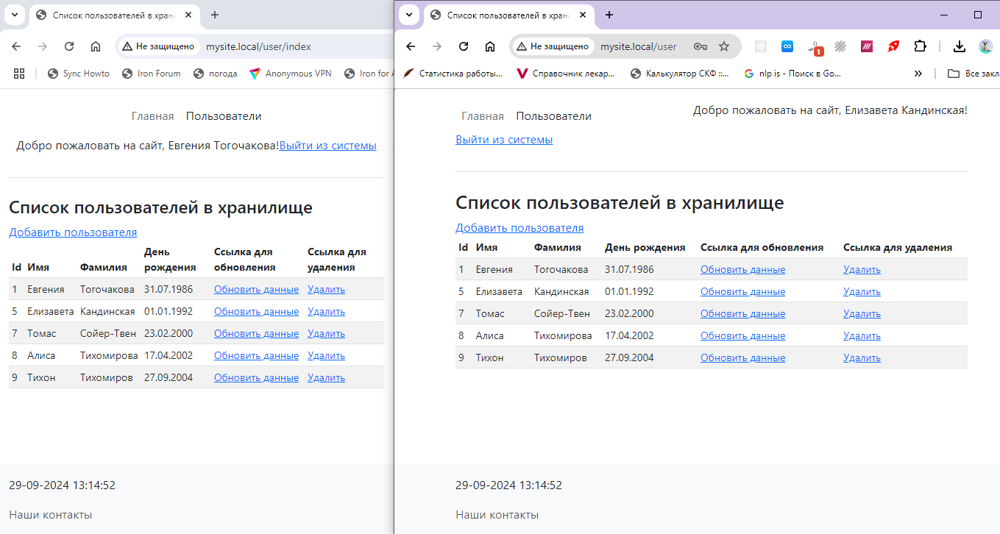
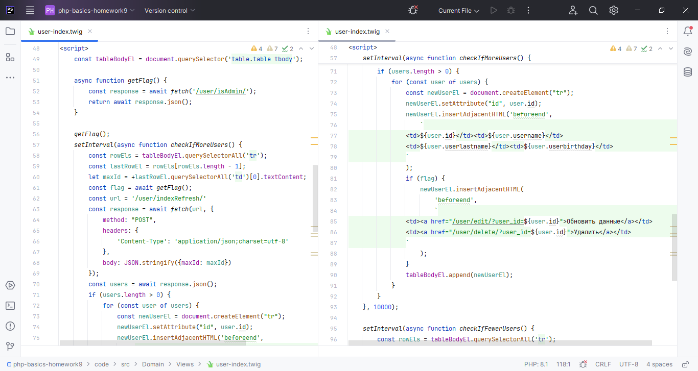
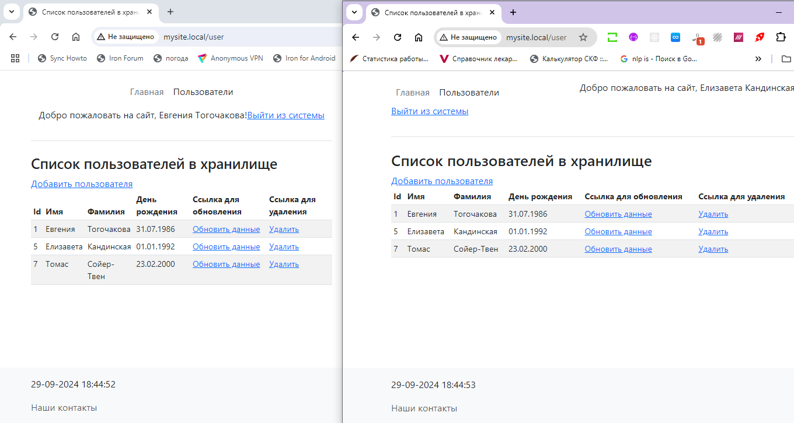
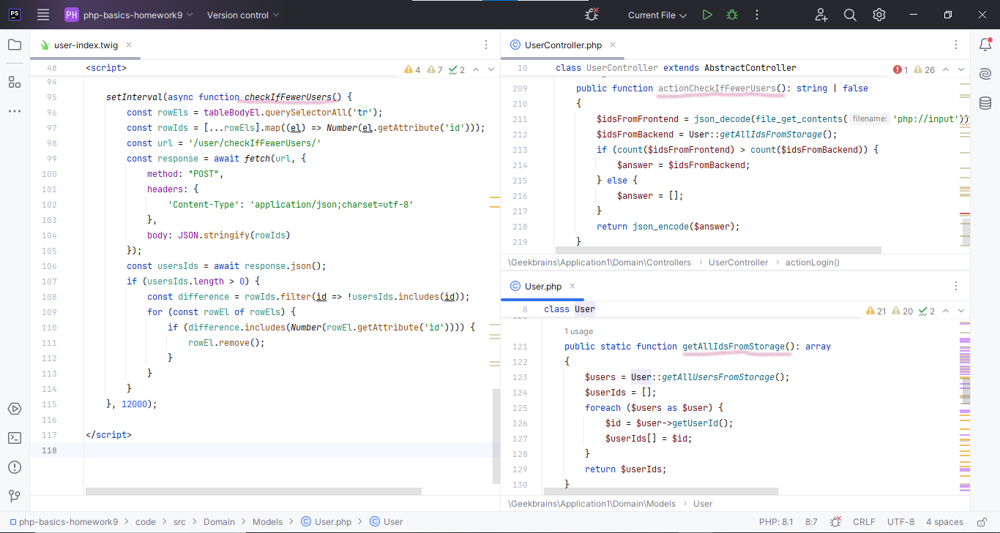

# PHP BASICS. Workshop 9. Homework. Тогочакова Евгения

Скорректируйте список пользователей так, чтобы все пользователи с правами администратора в таблице видели две дополнительные ссылки – 
редактирование и удаление пользователя. При этом редактирование будет переходить на форму, а удаление в асинхронном режиме 
будет удалять пользователя как из таблицы, так и из БД.

Согласно ролям пользователей обычным пользователям не предоставляются ссылки на редактирование или удаление.
На иллюстрации ниже пользователь с админскими привилегиями добавил пользователя, и это сразу отобразилось 
на странице у обычного пользователя.

А вот как видит таблицу пользователь-админ, когда другой админ добавил еще одного пользователя.
Есть ссылки на редактирование и удаление.

Вот код на нативном JS для того, чтобы страница раз в 10 секунд отправляла
асинхронный запрос на обновление данных (добавлены ли новые пользователи?).
Добавлен флаг, чтобы отличать админов от неадминов, ведь админy нужно видеть еще две дополнительные ссылки.

А теперь страница умеет каждые 12 секунд отправить асинхронный запрос, чтобы понять, каких пользователей
надо удалить со страницы.

Для этого написан следующий код на нативном JS, а также добавлены соответствующие методы в UserController и User.

